# GitHub Claude Workflow System v2

An AI-powered development pipeline that successfully combines intelligent automation with human oversight. Transform GitHub issues into production-ready features through a systematic four-stage workflow based on the [GitHub spec-kit](https://github.com/github/spec-kit) methodology.

## What It Does

This system transforms GitHub issues into production-ready features through a systematic four-stage workflow based on the [GitHub spec-kit](https://github.com/github/spec-kit) methodology:

```mermaid
flowchart TD
    A[Human creates issue] --> B[Mention @claude-dev-truefrontier]
    B --> C[📋 Specify Stage]
    C --> D{Human Review}
    D -->|Approve| E[🏗️ Plan Stage]
    E --> F{Human Review}
    F -->|Approve| G[📝 Tasks Stage]
    G --> H{Human Review}
    H -->|Approve| I[💻 Develop Stage]
    I --> J{Human Review}
    J -->|Approve| K[✅ Feature Complete]
    J -->|Changes Needed| L[🔄 Revision]
    L --> I

    style C fill:#e1f5fe
    style E fill:#fff3e0
    style G fill:#f3e5f5
    style I fill:#e8f5e8
```



## Why This Approach

### Problems It Solves
- **Inconsistent development process**: Standardizes how features are specified, planned, and built using [GitHub spec-kit](https://github.com/github/spec-kit) methodology
- **Missing requirements**: Ensures thorough specification and planning before coding begins, preventing costly rework
- **Poor documentation**: Generates comprehensive specifications, technical plans, and task breakdowns as searchable knowledge
- **Team coordination overhead**: AI handles systematic analysis while humans focus on strategic decision-making
- **Context loss**: Maintains complete conversation history and decision rationale throughout all four stages

### Technical Innovation
- **Elegant state machine architecture**: Label-based workflow management provides visible, auditable process control
- **Security-first design**: Progressive tool access control ensures AI has appropriate permissions per stage complexity
- **Race condition prevention**: Explicit assignee-before-label ordering prevents workflow conflicts
- **Natural language control**: Simple commands like "skip to develop" or "request changes" maintain human authority

### Benefits for Teams
- **Quality assurance**: Each stage produces specific deliverables with mandatory human checkpoints and follows [spec-kit](https://github.com/github/spec-kit) methodology
- **Scalable coordination**: Handle multiple issues simultaneously without adding process overhead
- **Knowledge democratization**: Creates structured documentation accessible to technical and non-technical stakeholders
- **Systematic approach**: All four stages are required, ensuring comprehensive analysis from specification through implementation

## How It Works

### State Machine Architecture
The system uses GitHub labels as state indicators:
- `needs:*` → AI is working on a stage
- `review:*` → Human review required
- `error:*` → Human intervention needed

### Stage Breakdown

#### 📋 **Specify Stage** *(Required)*
**What**: Creates comprehensive software specifications following [GitHub spec-kit](https://github.com/github/spec-kit) methodology
**Deliverable**: Structured feature specification document with:
- User stories and acceptance scenarios (Given-When-Then format)
- Functional and non-functional requirements
- Key entities and data models
- Success criteria and edge cases
- Review checklist for human approval

#### 🏗️ **Plan Stage** *(Required)*
**What**: Develops detailed technical implementation plan based on approved specifications
**Deliverable**: Technical plan document with:
- Technology stack analysis and recommendations
- Architecture overview and component design
- Phase-based implementation strategy
- Risk assessment and mitigation strategies
- Dependencies and prerequisites

#### 📝 **Tasks Stage** *(Required)*
**What**: Breaks down technical plan into specific, actionable development tasks
**Deliverable**: Systematic task breakdown with:
- Numbered tasks (T001, T002, etc.) with dependencies
- Test-driven development approach
- Parallel task identification [P]
- File-specific implementation guidance
- Dependency graph and completion criteria

#### 💻 **Develop Stage** *(Required)*
**What**: Implements the complete feature following approved specifications, plan, and tasks
**Deliverable**: Production-ready code on feature branch
- Creates feature branch following approved task sequence
- Implements all approved requirements with comprehensive testing
- Integrates human feedback from all previous stages
- Provides PR-ready implementation with 100% test pass rate

### Human Control Points

**You stay in complete control** - the AI assists but never decides. Use natural language commands:
- **Approve**: `@claude-dev-truefrontier proceed` or check boxes and mention bot
- **Request changes**: Describe what needs revision and mention bot
- **Stop workflow**: `@claude-dev-truefrontier stop` (immediate halt and cleanup)

**Note**: All four stages are required and must be completed in sequence. Each stage builds on the previous one's approved output.

### Example Workflow

1. **Create issue**: Describe the feature or bug
2. **Start workflow**: Comment `@claude-dev-truefrontier`
3. **Review specification**: Approve user stories, requirements, and acceptance criteria
4. **Review technical plan**: Approve architecture, technology choices, and implementation strategy
5. **Review task breakdown**: Approve the systematic task sequence (T001, T002, etc.)
6. **Review implementation**: Test the feature branch following the approved tasks
7. **Create PR**: Use the provided link to create pull request

Each stage builds on the previous one's approved output, ensuring comprehensive development planning.

## Getting Started

### ⚡ **One-Command Installation** (Recommended)
```bash
# Initialize workflow in any repository
npx @truefrontier/claude-dev-workflow init
```
This interactive command automatically detects your project type (Node.js, PHP, Python, Rust, Go, Java, .NET) and configures everything: workflow files, labels, secrets, and project-specific commands.

### 📋 **Quick Commands**
```bash
npx @truefrontier/claude-dev-workflow help      # Detailed setup guide with platform detection
npx @truefrontier/claude-dev-workflow init      # Interactive setup wizard with project analysis
npx @truefrontier/claude-dev-workflow validate  # Check current configuration and project compatibility
npx @truefrontier/claude-dev-workflow labels --setup # Create workflow labels
```

### 🎯 **Platform-Agnostic Design**
The workflow system automatically detects and adapts to your project:
- **Node.js**: Reads `package.json`, detects React/Vue/Angular/Express
- **PHP**: Reads `composer.json`, detects Laravel/Symfony/CakePHP
- **Python**: Reads `requirements.txt`/`pyproject.toml`, detects Django/Flask
- **Rust**: Reads `Cargo.toml`, detects web frameworks
- **Go**: Reads `go.mod`, detects Gin/Echo/Gorilla
- **Java**: Reads `pom.xml`/`build.gradle`, detects Spring Boot
- **.NET**: Reads `.csproj`, detects ASP.NET Core

### Prerequisites
- **GitHub repository** with Issues enabled
- **GitHub CLI** (`gh`) installed and authenticated
- **Claude GitHub App** installed on your repository ([github.com/apps/claude](https://github.com/apps/claude))
- **Repository admin access** (for secrets and collaborator management)
- **Anthropic API key** (get from console.anthropic.com)

### Alternative: Manual Installation
If you prefer manual setup or need customization:

1. **Install Claude GitHub App**: The `init` command automatically opens the installation URL, or visit [github.com/apps/claude](https://github.com/apps/claude) manually
2. **Copy workflow files** to `.github/workflows/` from this repository
3. **Configure API secret**: `gh secret set ANTHROPIC_API_KEY`
4. **Setup workflow labels**: `npx @truefrontier/claude-dev-workflow labels --setup`
5. **Add bot collaborator**: `gh repo add-collaborator claude-dev-truefrontier` (if user exists)
6. **Test the system**: Create an issue and comment `@claude-dev-truefrontier`

### Configuration
Each workflow can be customized by modifying:
- **Tool allowlists**: Control what actions AI can perform
- **Stage prompts**: Adjust AI behavior and deliverables  
- **Trigger conditions**: Modify when workflows execute
- **Assignment logic**: Change human assignment patterns

## Project Structure

### Workflow Files
- **`workflows/orchestrator.yml`**: Main controller that interprets human commands and manages state transitions using GitHub MCP tools
- **`workflows/stage-specify.yml`**: Creates comprehensive software specifications following [GitHub spec-kit](https://github.com/github/spec-kit) methodology
- **`workflows/stage-plan.yml`**: Develops detailed technical implementation plans with architecture and risk assessment
- **`workflows/stage-tasks.yml`**: Breaks down plans into systematic, numbered tasks with dependencies and parallel execution
- **`workflows/stage-develop.yml`**: Implements features following approved specifications, plans, and task breakdowns

### Scripts
- **`scripts/setup-labels.sh`**: Unix/Linux/macOS label setup script
- **`scripts/setup-labels.bat`**: Windows label setup script

### npm Scripts
Comprehensive tooling for setup, validation, and maintenance:
```bash
npm run setup:help        # Interactive setup guide with prerequisites
npm run setup:labels      # Cross-platform GitHub label creation  
npm run validate:workflows # Pre-deployment workflow validation
npm run docs:labels       # Complete label system documentation
```

### Troubleshooting & Validation
Before deploying, validate your setup:
```bash
npm run validate:workflows  # Check workflow files for common issues
gh auth status             # Verify GitHub CLI authentication  
gh secret list             # Confirm ANTHROPIC_API_KEY is configured
```

**Common Setup Issues:**
- **GitHub CLI not authenticated**: Run `gh auth login`
- **Missing repository permissions**: Ensure admin access for secrets/collaborators
- **API key invalid**: Verify key works at console.anthropic.com
- **Workflow files not copied**: Check `.github/workflows/` directory exists

## Security & Technical Design

### Security Architecture
- **Progressive privilege escalation**: AI gains broader tool access only as stages advance
- **Stage-specific restrictions**: Specify/Plan/Tasks stages limited to read-only operations, web research, and GitHub comment management using MCP tools
- **Development stage controls**: Full file system access only when implementing approved specifications, plans, and tasks
- **Assignee-based authorization**: Workflows trigger only on properly assigned issues
- **Human checkpoint enforcement**: Mandatory approval between all four required stages prevents unauthorized progression
- **MCP-based operations**: Uses secure GitHub MCP tools instead of direct CLI commands for better integration

### Technical Safeguards
- **Race condition prevention**: Atomic assignee-then-label operations prevent workflow conflicts
- **State machine integrity**: Exactly one workflow label per issue at all times
- **Comment filtering**: Automatic bot loop prevention with validation
- **Error recovery**: Comprehensive error states with human intervention paths
- **Audit trail**: Complete workflow history preserved in GitHub issue comments

### Current Limitations
- **Setup complexity**: Requires GitHub CLI, API keys, and repository admin access
- **External dependencies**: Relies on @claude-dev-truefrontier user availability
- **Single repository scope**: Each repository needs independent setup
- **GitHub Actions dependency**: Requires GitHub Actions enabled and sufficient quota

## License

MIT License - see LICENSE file for details
