# GitHub Claude Workflow System

The first AI-powered development pipeline that successfully combines intelligent automation with human oversight. Transform GitHub issues into production-ready features through structured stages with natural language control.

## What It Does

This system transforms GitHub issues into production-ready features through a four-stage workflow:

```mermaid
flowchart TD
    A[Human creates issue] --> B[Mention @claude-dev-truefrontier]
    B --> C[🔍 Triage Stage]
    C --> D{Human Review}
    D -->|Approve| E[📝 Spec Stage]
    D -->|Skip| I[💻 Develop Stage]
    E --> F{Human Review}
    F -->|Approve| G[🏗️ Architect Stage]
    F -->|Skip| I
    G --> H{Human Review}
    H -->|Approve| I[💻 Develop Stage]
    I --> J{Human Review}
    J -->|Approve| K[✅ Feature Complete]
    J -->|Changes Needed| L[🔄 Revision]
    L --> I
    
    style C fill:#e1f5fe
    style E fill:#f3e5f5
    style G fill:#fff3e0
    style I fill:#e8f5e8
```



## Why This Approach

### Problems It Solves
- **Inconsistent development process**: Standardizes how features are analyzed, planned, and built across diverse teams
- **Missing requirements**: Ensures thorough analysis before coding begins, preventing costly rework
- **Poor documentation**: Generates BDD specs and architecture docs automatically as searchable knowledge
- **Team coordination overhead**: AI handles routine analysis while humans focus on strategic decision-making
- **Context loss**: Maintains complete conversation history and decision rationale throughout development

### Technical Innovation
- **Elegant state machine architecture**: Label-based workflow management provides visible, auditable process control
- **Security-first design**: Progressive tool access control ensures AI has appropriate permissions per stage complexity
- **Race condition prevention**: Explicit assignee-before-label ordering prevents workflow conflicts
- **Natural language control**: Simple commands like "skip to develop" or "request changes" maintain human authority

### Benefits for Teams
- **Quality assurance**: Each stage produces specific deliverables with mandatory human checkpoints
- **Scalable coordination**: Handle multiple issues simultaneously without adding process overhead
- **Knowledge democratization**: Creates documentation accessible to technical and non-technical stakeholders
- **Flexible complexity**: Start simple with triage-only, gradually add specification and architecture stages

## How It Works

### State Machine Architecture
The system uses GitHub labels as state indicators:
- `needs:*` → AI is working on a stage
- `review:*` → Human review required
- `error:*` → Human intervention needed

### Stage Breakdown

#### 🔍 **Triage Stage**
**What**: Analyzes the issue and current codebase
**Deliverable**: Structured analysis with checkboxes for human selection
```
✅ What's working (keep it)
🔧 Needs fixing
➕ Needs adding  
❓ Needs clarification
```

#### 📝 **Spec Stage** *(Optional)*
**What**: Creates BDD specification in Gherkin format
**Deliverable**: Complete `.feature` file with scenarios
```gherkin
Feature: User Authentication
  Scenario: Successful login
    Given a registered user
    When they enter valid credentials
    Then they should be logged in
```

#### 🏗️ **Architect Stage** *(Optional)*
**What**: Designs technical architecture for complex features
**Deliverable**: Comprehensive architecture document with:
- System design and component relationships
- Database schema and API specifications
- Security and performance considerations
- Implementation phases and risk mitigation

#### 💻 **Develop Stage** *(Required)*
**What**: Implements the complete feature with full testing
**Deliverable**: Production-ready code on feature branch
- Creates feature branch
- Implements all approved requirements
- Writes comprehensive tests (100% pass rate required)
- Provides PR-ready implementation

### Human Control Points

**You stay in complete control** - the AI assists but never decides. Use natural language commands:
- **Approve**: `@claude-dev-truefrontier proceed` or check boxes and mention bot
- **Request changes**: Describe what needs revision and mention bot  
- **Skip stages**: `@claude-dev-truefrontier skip to develop` (perfect for simple bug fixes)
- **Stop workflow**: `@claude-dev-truefrontier stop` (immediate halt and cleanup)

### Example Workflow

1. **Create issue**: Describe the feature or bug
2. **Start workflow**: Comment `@claude-dev-truefrontier` 
3. **Review triage**: Check boxes for approved items, mention bot
4. **Review spec** (optional): Approve BDD scenarios or request changes
5. **Review architecture** (optional): Approve technical design
6. **Review implementation**: Test the feature branch and approve/request changes
7. **Create PR**: Use the provided link to create pull request

## Getting Started

> **New to the system?** Start with `npm run setup:help` for a guided walkthrough with all prerequisites and decision points clearly explained.

### Quick Start (2 minutes)
```bash
# Clone or download this repository
git clone https://github.com/your-org/github-claude-workflow.git
cd github-claude-workflow

# Run guided setup
npm install
npm run setup:help    # Shows prerequisites and walkthrough
npm run setup:labels  # Creates required GitHub labels
```

### Prerequisites
- **GitHub repository** with Issues enabled
- **GitHub CLI** (`gh`) installed and authenticated
- **Repository admin access** (for secrets and collaborator management)
- **Anthropic API key** (get from console.anthropic.com)

### Full Installation
1. **Copy workflow files** to `.github/workflows/`
2. **Configure API secret**:
   ```bash
   gh secret set ANTHROPIC_API_KEY
   ```
3. **Setup workflow labels**:
   ```bash
   # Recommended: Cross-platform npm approach
   npm run setup:labels
   
   # Alternative: Direct script execution
   ./scripts/setup-labels.sh      # Unix/Linux/macOS
   scripts\setup-labels.bat       # Windows
   ```
4. **Add bot collaborator**:
   ```bash
   gh repo add-collaborator claude-dev-truefrontier
   ```
5. **Test the system**: Create an issue and comment `@claude-dev-truefrontier`

### Configuration
Each workflow can be customized by modifying:
- **Tool allowlists**: Control what actions AI can perform
- **Stage prompts**: Adjust AI behavior and deliverables  
- **Trigger conditions**: Modify when workflows execute
- **Assignment logic**: Change human assignment patterns

## Project Structure

### Workflow Files
- **`workflows/orchestrator.yml`**: Main controller that interprets human commands and manages state transitions
- **`workflows/stage-triage.yml`**: Issue analysis and scope definition
- **`workflows/stage-spec.yml`**: BDD specification creation using Gherkin format
- **`workflows/stage-architect.yml`**: Technical architecture design for complex features  
- **`workflows/stage-develop.yml`**: Code implementation with testing and feature branch creation

### Scripts
- **`scripts/setup-labels.sh`**: Unix/Linux/macOS label setup script
- **`scripts/setup-labels.bat`**: Windows label setup script

### npm Scripts
Comprehensive tooling for setup, validation, and maintenance:
```bash
npm run setup:help        # Interactive setup guide with prerequisites
npm run setup:labels      # Cross-platform GitHub label creation  
npm run validate:workflows # Pre-deployment workflow validation
npm run docs:labels       # Complete label system documentation
```

### Troubleshooting & Validation
Before deploying, validate your setup:
```bash
npm run validate:workflows  # Check workflow files for common issues
gh auth status             # Verify GitHub CLI authentication  
gh secret list             # Confirm ANTHROPIC_API_KEY is configured
```

**Common Setup Issues:**
- **GitHub CLI not authenticated**: Run `gh auth login`
- **Missing repository permissions**: Ensure admin access for secrets/collaborators
- **API key invalid**: Verify key works at console.anthropic.com
- **Workflow files not copied**: Check `.github/workflows/` directory exists

## Security & Technical Design

### Security Architecture
- **Progressive privilege escalation**: AI gains broader tool access only as stages advance
- **Stage-specific restrictions**: Triage/Spec stages limited to read-only operations and issue management
- **Development stage controls**: Full file system access only when implementing approved specifications
- **Assignee-based authorization**: Workflows trigger only on properly assigned issues
- **Human checkpoint enforcement**: Mandatory approval between all stages prevents unauthorized progression

### Technical Safeguards
- **Race condition prevention**: Atomic assignee-then-label operations prevent workflow conflicts
- **State machine integrity**: Exactly one workflow label per issue at all times
- **Comment filtering**: Automatic bot loop prevention with validation
- **Error recovery**: Comprehensive error states with human intervention paths
- **Audit trail**: Complete workflow history preserved in GitHub issue comments

### Current Limitations
- **Setup complexity**: Requires GitHub CLI, API keys, and repository admin access
- **External dependencies**: Relies on @claude-dev-truefrontier user availability
- **Single repository scope**: Each repository needs independent setup
- **GitHub Actions dependency**: Requires GitHub Actions enabled and sufficient quota

## License

MIT License - see LICENSE file for details