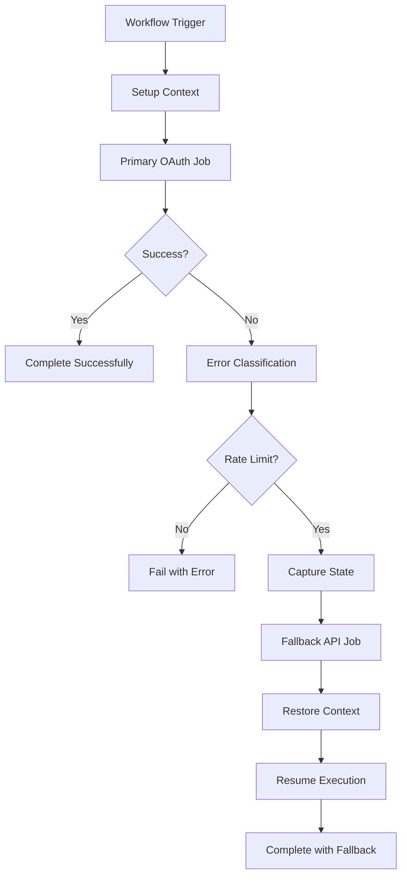

# OAuth-to-API Token Fallback System Specification

**Feature:** OAuth-to-API Token Fallback
**Version:** 1.0
**Date:** 2025-09-28
**Status:** Ready for Development

## Executive Summary

This specification defines an intelligent authentication fallback system for Claude workflows that uses OAuth tokens (Pro/Max subscription) by default, with automatic fallback to API tokens when OAuth limits are exceeded. The system preserves workflow state and resumes execution seamlessly, optimizing costs while maintaining reliability.

## User Description

Users with Claude Pro/Max subscriptions want to maximize the value of their subscription by using their included usage limits for GitHub workflow automation. When those limits are exceeded, the system should automatically fall back to API token billing without interrupting the workflow or losing progress.

## Primary User Story

As a Claude Pro/Max subscriber using GitHub workflows, I want to use my subscription's included usage limits first, so that I can minimize additional API costs while ensuring my workflows complete successfully even when I hit subscription limits.

## User Scenarios & Testing

### Acceptance Scenarios

**Scenario 1: Normal OAuth Success**
**Given** a user has valid OAuth token and available subscription limits
**When** a workflow is triggered requiring Claude execution
**Then** the workflow executes successfully using OAuth authentication
**And** no API token charges are incurred
**And** the workflow completes without fallback activation

**Scenario 2: OAuth Rate Limit with Successful Fallback**
**Given** a user's OAuth token hits subscription rate limits during execution
**When** the Claude action returns a 429 rate limit error
**Then** the fallback job automatically starts with API token
**And** execution resumes from the point of interruption
**And** the workflow completes successfully
**And** the user is notified which authentication method was used

**Scenario 3: Non-Rate-Limit OAuth Error**
**Given** an OAuth token encounters a non-rate-limit error (e.g., invalid token)
**When** the Claude action fails with authentication error
**Then** the fallback is NOT triggered
**And** the workflow fails with appropriate error message
**And** the user is directed to fix the OAuth configuration

**Scenario 4: API Token Fallback Failure**
**Given** OAuth fails due to rate limits AND API token is invalid/missing
**When** the fallback job attempts to use API token
**Then** the workflow fails with clear error message
**And** execution context is preserved for manual retry
**And** the user receives guidance on fixing token configuration

### Edge Cases

- **Scenario A: Mid-execution Rate Limit** - OAuth limit hit during large response generation
- **Scenario B: Multiple Concurrent Workflows** - Rate limits affecting multiple simultaneous executions
- **Scenario C: Token Refresh During Execution** - OAuth token expires and refreshes mid-workflow
- **Scenario D: Partial Response Scenarios** - Claude action partially completes before hitting limits

## Requirements

### Functional Requirements

1. **Dual Authentication Support**
   - System MUST support both OAuth and API token authentication methods
   - OAuth tokens MUST be attempted first when available
   - API tokens MUST be used as fallback for rate limit scenarios only

2. **Error Detection and Classification**
   - System MUST detect Claude API rate limit errors (429, 529, token limits)
   - System MUST differentiate between rate limit and other error types
   - System MUST parse Claude API response headers for rate limit information

3. **State Preservation**
   - System MUST preserve workflow context before Claude execution
   - System MUST capture issue state, comments, and progress
   - System MUST prevent duplication of completed work

4. **Seamless Resumption**
   - Fallback job MUST resume from point of OAuth failure
   - System MUST maintain conversation context and history
   - Users MUST NOT need to manually intervene for fallback

5. **Transparent Operation**
   - Users MUST be notified which authentication method was used
   - Workflow logs MUST clearly indicate fallback activation
   - Cost implications MUST be communicated in workflow outputs

6. **Configuration Management**
   - System MUST support feature flag to enable/disable fallback
   - Both token types MUST be configurable via GitHub secrets
   - System MUST validate token availability before execution

### Key Entities

- **Authentication Manager**: Handles token selection and fallback logic
- **Error Classifier**: Analyzes Claude API responses and determines fallback necessity
- **State Preserver**: Captures and restores workflow execution context
- **Execution Coordinator**: Manages primary and fallback job orchestration

### Non-Functional Requirements

- **Performance**: Fallback activation MUST occur within 60 seconds of primary failure
- **Security**: All tokens MUST be stored as GitHub secrets, never logged or exposed
- **Usability**: Fallback operation MUST be transparent with clear status communication
- **Compatibility**: Solution MUST work with existing workflow patterns without breaking changes

## Technical Context

### Current Technology Stack
- **Platform**: GitHub Actions workflows (.yml files)
- **Authentication**: Currently uses `secrets.ANTHROPIC_API_KEY` only
- **Claude Integration**: `anthropics/claude-code-action@v1`
- **Language**: YAML workflow syntax + bash scripting
- **State Management**: GitHub API, issue comments, workflow artifacts

### Performance Goals
- **Fallback Activation Time**: < 60 seconds from primary failure
- **State Preservation**: < 10 seconds to capture context
- **Resumption Time**: < 30 seconds to restore and continue

### Technical Constraints
- **GitHub Actions Limits**: 6-hour workflow timeout, artifact size limits
- **Token Security**: Must use GitHub secrets, no token exposure in logs
- **Backward Compatibility**: Existing workflows must continue working

## Constitution Check

### Project Principles Alignment
- [x] **Simplicity**: Uses existing GitHub Actions patterns with minimal new complexity
- [x] **Architecture**: Extends current workflow pattern without fundamental changes
- [x] **Testing**: Includes comprehensive error scenario testing
- [x] **Observability**: Provides clear logging and status reporting
- [x] **Documentation**: Includes setup guides and troubleshooting

## Architecture Overview

The system implements a dual-job architecture within each stage workflow:

1. **Primary OAuth Job**: Attempts execution with OAuth token
2. **Error Detection**: Analyzes failure type and captures context
3. **Fallback API Job**: Executes with API token if OAuth rate limited
4. **State Management**: Preserves context between jobs using GitHub artifacts



## Implementation Strategy

### Development Approach
- **Pattern**: Extend existing workflow structure with conditional job execution
- **Structure**: Add error detection and state management steps to current workflows
- **Integration**: Leverage GitHub Actions job dependencies and conditional execution

### Key Components

#### 1. Authentication Manager
- **Purpose**: Select appropriate token and manage fallback logic
- **Responsibilities**: Token validation, fallback triggering, usage tracking
- **Interfaces**: GitHub secrets API, workflow conditional expressions

#### 2. Error Detection System
- **Purpose**: Analyze Claude API responses and classify failure types
- **Responsibilities**: Parse error messages, examine response headers, determine fallback necessity
- **Interfaces**: Claude action outputs, GitHub workflow logs

#### 3. State Preservation Engine
- **Purpose**: Capture and restore workflow execution context
- **Responsibilities**: Save issue state, preserve progress, restore context for resumption
- **Interfaces**: GitHub artifacts API, issue comments API

#### 4. Execution Coordinator
- **Purpose**: Orchestrate primary and fallback job execution
- **Responsibilities**: Job dependency management, conditional execution, status reporting
- **Interfaces**: GitHub Actions job system, workflow outputs

### Data Flow & Storage

#### Data Models
```yaml
# Execution Context
ExecutionContext:
  stage: string           # specify|plan|develop
  issueNumber: integer
  timestamp: string
  isRevision: boolean
  lastHumanUser: string
  executionPoint: string  # pre-claude-action|post-setup|etc
  comments: array
  labels: array
  failureReason: string   # oauth-rate-limit|server-overload|other

# Authentication State
AuthState:
  primaryToken: string    # oauth|api
  fallbackToken: string   # api|none
  usageTracking: object
  rateLimitInfo: object
```

#### Storage Strategy
- **Primary Storage**: GitHub workflow artifacts for execution context
- **Backup Storage**: Special issue comments with embedded state data
- **Temporary Storage**: Workflow outputs for job-to-job communication

## Phase Planning

### Phase 0: Research & Setup ✅
- [x] Analyze existing codebase patterns
- [x] Research Claude API authentication methods
- [x] Study GitHub Actions failure handling patterns
- [x] Design architecture and approach

### Phase 1: Core Infrastructure
- [ ] Implement error detection and classification system
- [ ] Create state preservation mechanism using GitHub artifacts
- [ ] Develop authentication manager with token selection logic
- [ ] Build execution coordinator for job orchestration

### Phase 2: Workflow Integration
- [ ] Modify `stage-specify.yml` with dual-job pattern
- [ ] Update `stage-plan.yml` with error detection and fallback
- [ ] Enhance `stage-develop.yml` with state preservation
- [ ] Add orchestrator workflow fallback support

### Phase 3: Configuration & Testing
- [ ] Implement configuration management (secrets, feature flags)
- [ ] Create comprehensive test scenarios for all failure modes
- [ ] Add monitoring and logging for authentication usage
- [ ] Develop troubleshooting guides and documentation

## Testing Strategy

### Unit Testing
- **Error Classification**: Test parsing of various Claude API error responses
- **State Preservation**: Verify context capture and restoration accuracy
- **Token Selection**: Validate authentication method selection logic

### Integration Testing
- **Workflow Execution**: Test complete OAuth → API fallback flow
- **State Continuity**: Ensure no work duplication between jobs
- **Error Handling**: Verify appropriate failure modes and error messages

### End-to-End Testing
- **User Workflows**: Test complete specification → plan → develop flow with fallback
- **Cost Optimization**: Verify OAuth usage before API billing
- **Resilience**: Test recovery from various failure scenarios

### Performance Testing
- **Fallback Speed**: Measure time from OAuth failure to API resumption
- **State Overhead**: Assess impact of context preservation on workflow performance
- **Concurrent Execution**: Test multiple workflows hitting rate limits simultaneously

## Risk Assessment & Mitigation

### Technical Risks

**Risk 1: State Loss During Fallback**
- **Description**: Execution context not properly preserved between jobs
- **Impact**: Work duplication, incomplete execution, user confusion
- **Mitigation**: Implement redundant state storage (artifacts + comments), comprehensive testing

**Risk 2: Token Security Exposure**
- **Description**: OAuth or API tokens accidentally logged or exposed
- **Impact**: Security vulnerability, unauthorized access
- **Mitigation**: Use GitHub secrets exclusively, audit all logging, implement token masking

**Risk 3: Infinite Fallback Loops**
- **Description**: Fallback job also hits rate limits, creating retry loops
- **Impact**: Workflow timeout, resource waste, user frustration
- **Mitigation**: Implement fallback attempt limits, clear error messaging, circuit breaker pattern

### Integration Risks

**Risk 4: GitHub Actions Limitations**
- **Description**: Workflow timeout, artifact size limits, job dependency issues
- **Impact**: Failed executions, data loss, system unreliability
- **Mitigation**: Optimize context size, implement chunked storage, use timeout buffers

**Risk 5: Claude API Changes**
- **Description**: Claude API error formats or authentication methods change
- **Impact**: Broken error detection, failed fallback triggering
- **Mitigation**: Version-aware error parsing, backward compatibility, monitoring

## Dependencies & Prerequisites

### External Dependencies
- [x] **GitHub Actions**: Workflow execution platform
- [x] **Anthropic Claude API**: Both OAuth and API token authentication
- [x] **claude-code-action**: Anthropic's GitHub Actions integration
- [x] **GitHub Secrets**: Secure token storage

### Internal Dependencies
- [x] **Existing Workflows**: Current stage-based workflow system
- [x] **State Management**: Issue and comment tracking system
- [x] **Error Handling**: Basic workflow error patterns

### Infrastructure Requirements
- [ ] **Dual Token Configuration**: Both OAuth and API tokens available
- [ ] **Feature Flag System**: Enable/disable fallback behavior
- [ ] **Monitoring Setup**: Track authentication method usage

### Team Dependencies
- [ ] **Token Management**: Process for obtaining and configuring OAuth tokens
- [ ] **Testing Framework**: Ability to simulate rate limit scenarios
- [ ] **Documentation**: User guides for setup and troubleshooting

## Complexity Tracking

- **Overall Complexity**: Medium-High
  - Requires multi-job workflow coordination
  - Complex error detection and state management
  - Multiple authentication methods and failure modes

- **Technical Debt Impact**: Low
  - Extends existing patterns without fundamental changes
  - Maintains backward compatibility
  - Adds optional functionality without breaking existing workflows

- **Maintenance Overhead**: Medium
  - Requires monitoring of two authentication systems
  - Need to track changes in Claude API and GitHub Actions
  - Additional testing scenarios for fallback behaviors

## Success Criteria

### Technical Completion
- [ ] All stage workflows support OAuth-first with API fallback
- [ ] Error detection correctly identifies rate limit vs other failures
- [ ] State preservation prevents work duplication between jobs
- [ ] Fallback activation occurs within 60 seconds of primary failure
- [ ] All tests pass including failure scenario simulation

### Business Completion
- [ ] Users can maximize Pro/Max subscription value before API billing
- [ ] Workflow interruptions due to rate limits are eliminated
- [ ] Cost transparency shows which authentication method was used
- [ ] Zero manual intervention required for fallback operation

### User Acceptance
- [ ] Transparent operation - users don't notice authentication switching
- [ ] Clear status communication about fallback activation
- [ ] Cost optimization delivers measurable subscription value
- [ ] Reliable workflow completion regardless of rate limit issues

## Implementation Tasks

### T001: Error Detection System
- **Files**: New error classification scripts in `.github/scripts/`
- **Purpose**: Parse Claude API responses and classify failure types
- **Acceptance**: Correctly identifies rate limit vs other errors with 95% accuracy

### T002: State Preservation Mechanism
- **Files**: Context capture/restore scripts, artifact management
- **Purpose**: Save and restore workflow execution context
- **Acceptance**: Zero data loss during context preservation/restoration

### T003: Authentication Manager
- **Files**: Token selection logic, fallback triggering
- **Purpose**: Manage OAuth-first with API fallback logic
- **Acceptance**: Correct token selection based on availability and error types

### T004: Workflow Integration - Specify Stage
- **Files**: `.github/workflows/stage-specify.yml`
- **Purpose**: Add dual-job pattern with error detection and fallback
- **Acceptance**: Specification stage completes successfully with either authentication method

### T005: Workflow Integration - Plan Stage
- **Files**: `.github/workflows/stage-plan.yml`
- **Purpose**: Implement fallback for technical planning stage
- **Acceptance**: Planning stage handles OAuth rate limits with seamless API fallback

### T006: Workflow Integration - Develop Stage
- **Files**: `.github/workflows/stage-develop.yml`
- **Purpose**: Add fallback support for development implementation
- **Acceptance**: Development stage preserves git context through authentication fallback

### T007: Configuration Management
- **Files**: Documentation, setup scripts, validation
- **Purpose**: Enable dual token configuration and feature flags
- **Acceptance**: Users can easily configure OAuth + API tokens with validation

### T008: Testing & Validation
- **Files**: Test scenarios, simulation scripts, monitoring
- **Purpose**: Comprehensive testing of all fallback scenarios
- **Acceptance**: 100% test coverage of error conditions and fallback paths

### T009: Documentation & Guides
- **Files**: Setup guides, troubleshooting docs, architecture diagrams
- **Purpose**: Enable users to understand and configure the system
- **Acceptance**: Users can self-service setup and troubleshooting

### T010: Monitoring & Optimization
- **Files**: Usage tracking, performance monitoring, cost reporting
- **Purpose**: Track authentication method usage and optimize performance
- **Acceptance**: Clear visibility into OAuth vs API usage patterns and costs

## Next Steps

1. **Review and Approve Specification**: Stakeholder validation of requirements and approach
2. **Technical Design Deep Dive**: Detailed implementation planning for each component
3. **Development Environment Setup**: Configure test scenarios and simulation capabilities
4. **Phased Implementation**: Begin with Phase 1 core infrastructure development
5. **Testing Framework**: Establish comprehensive testing for all failure scenarios

---

**Dependencies**: This specification assumes availability of both OAuth and API tokens, and requires GitHub Actions environment with secrets management capability.

**Success Metrics**:
- Zero workflow failures due to OAuth rate limits
- >90% OAuth usage before API fallback activation
- <60 second fallback activation time
- 100% state preservation accuracy during fallback